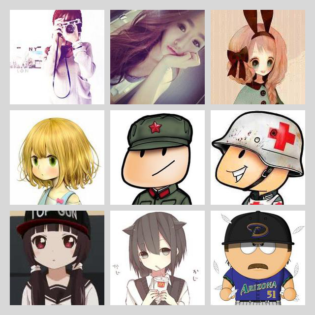

## Getting started

First download and install
[GraphicsMagick](http://www.graphicsmagick.org/) or [ImageMagick](http://www.imagemagick.org/)

then 

> yarn add group-avatar


## Usage

``` js
const generatorAvatar = require("group-avatar");
let inputs  = ['a.jpg', 'b.jpg', 'c.jpg',...];
generatorAvatar.draw(inputs,'o.png')
```

### example
generatorAvatar.draw(input,output);

input:Array  

output:string result image



